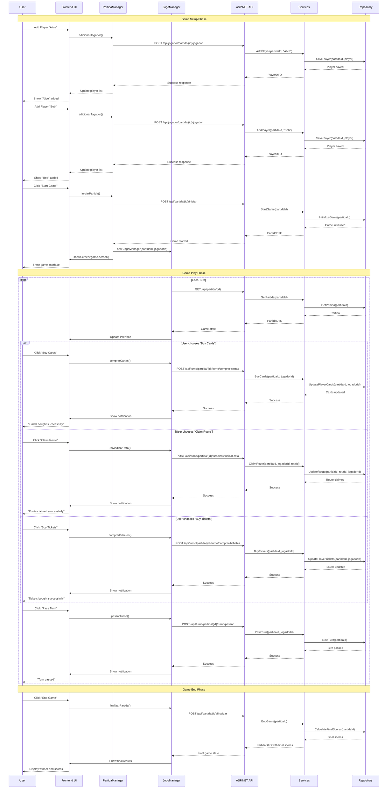

# Ticket to Ride - Sequence Diagram

```mermaid
sequenceDiagram
    participant U as User
    participant UI as Frontend UI
    participant PM as PartidaManager
    participant JM as JogoManager
    participant API as ASP.NET API
    participant SVC as Services
    participant REPO as Repository
    
    Note over U,REPO: Game Setup Phase
    U->>UI: Add Player "Alice"
    UI->>PM: adicionarJogador()
    PM->>API: POST /api/jogador/partida/{id}/jogador
    API->>SVC: AddPlayer(partidaId, "Alice")
    SVC->>REPO: SavePlayer(partidaId, player)
    REPO-->>SVC: Player saved
    SVC-->>API: PlayerDTO
    API-->>PM: Success response
    PM-->>UI: Update player list
    UI-->>U: Show "Alice" added
    
    U->>UI: Add Player "Bob"
    UI->>PM: adicionarJogador()
    PM->>API: POST /api/jogador/partida/{id}/jogador
    API->>SVC: AddPlayer(partidaId, "Bob")
    SVC->>REPO: SavePlayer(partidaId, player)
    REPO-->>SVC: Player saved
    SVC-->>API: PlayerDTO
    API-->>PM: Success response
    PM-->>UI: Update player list
    UI-->>U: Show "Bob" added
    
    U->>UI: Click "Start Game"
    UI->>PM: iniciarPartida()
    PM->>API: POST /api/partida/{id}/iniciar
    API->>SVC: StartGame(partidaId)
    SVC->>REPO: InitializeGame(partidaId)
    REPO-->>SVC: Game initialized
    SVC-->>API: PartidaDTO
    API-->>PM: Game started
    PM->>JM: new JogoManager(partidaId, jogadorId)
    PM->>UI: showScreen('game-screen')
    UI-->>U: Show game interface
    
    Note over U,REPO: Game Play Phase
    loop Each Turn
        JM->>API: GET /api/partida/{id}
        API->>SVC: GetPartida(partidaId)
        SVC->>REPO: GetPartida(partidaId)
        REPO-->>SVC: Partida
        SVC-->>API: PartidaDTO
        API-->>JM: Game state
        JM->>UI: Update interface
        
        alt User chooses "Buy Cards"
            U->>UI: Click "Buy Cards"
            UI->>JM: comprarCartas()
            JM->>API: POST /api/turno/partida/{id}/turno/comprar-cartas
            API->>SVC: BuyCards(partidaId, jogadorId)
            SVC->>REPO: UpdatePlayerCards(partidaId, jogadorId)
            REPO-->>SVC: Cards updated
            SVC-->>API: Success
            API-->>JM: Success
            JM->>UI: Show notification
            UI-->>U: "Cards bought successfully"
            
        else User chooses "Claim Route"
            U->>UI: Click "Claim Route"
            UI->>JM: reivindicarRota()
            JM->>API: POST /api/turno/partida/{id}/turno/reivindicar-rota
            API->>SVC: ClaimRoute(partidaId, jogadorId, rotaId)
            SVC->>REPO: UpdateRoute(partidaId, rotaId, jogadorId)
            REPO-->>SVC: Route claimed
            SVC-->>API: Success
            API-->>JM: Success
            JM->>UI: Show notification
            UI-->>U: "Route claimed successfully"
            
        else User chooses "Buy Tickets"
            U->>UI: Click "Buy Tickets"
            UI->>JM: comprarBilhetes()
            JM->>API: POST /api/turno/partida/{id}/turno/comprar-bilhetes
            API->>SVC: BuyTickets(partidaId, jogadorId)
            SVC->>REPO: UpdatePlayerTickets(partidaId, jogadorId)
            REPO-->>SVC: Tickets updated
            SVC-->>API: Success
            API-->>JM: Success
            JM->>UI: Show notification
            UI-->>U: "Tickets bought successfully"
        end
        
        U->>UI: Click "Pass Turn"
        UI->>JM: passarTurno()
        JM->>API: POST /api/turno/partida/{id}/turno/passar
        API->>SVC: PassTurn(partidaId, jogadorId)
        SVC->>REPO: NextTurn(partidaId)
        REPO-->>SVC: Turn passed
        SVC-->>API: Success
        API-->>JM: Success
        JM->>UI: Show notification
        UI-->>U: "Turn passed"
    end
    
    Note over U,REPO: Game End Phase
    U->>UI: Click "End Game"
    UI->>JM: finalizarPartida()
    JM->>API: POST /api/partida/{id}/finalizar
    API->>SVC: EndGame(partidaId)
    SVC->>REPO: CalculateFinalScores(partidaId)
    REPO-->>SVC: Final scores
    SVC-->>API: PartidaDTO with final scores
    API-->>JM: Final game state
    JM->>UI: Show final results
    UI-->>U: Display winner and scores
```